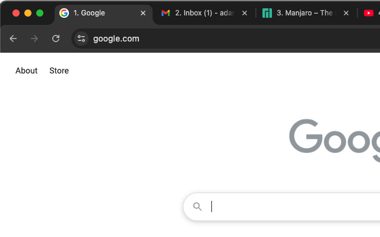

# NumJump



**Tired of counting tabs to find the one you want?**

**NumJump** makes navigating your Chrome tabs easier and faster by automatically adding **number prefixes** to each tab’s title. Now you can visually identify tabs by number and quickly switch using your keyboard.

This extension is perfect for:
* Developers who work with many tabs
* Power users who rely on keyboard navigation
* Anyone who wants better control over their Chrome workspace

## Key Features
* **Auto-numbered tabs**: Tabs are automatically prefixed with numbers 1 - 8. The last tab in a window is labeled ```9.```, and all others beyond 9 are marked as ```-.```.

* **Dynamic renumbering**: Tabs are updated in real time when opened, closed, moved, or rearranged.

* **Smart handling**: Chrome-internal tabs (e.g., ```chrome://```) and restricted pages are safely skipped.

* **Minimal permissions**: Works only on active tab titles and doesn’t read or track content.

## How it Works
As soon as the extension is installed, it begins monitoring your tab activity. Whenever you open, close, move, or update a tab, the extension renames the tab's title to include a number prefix based on its position in the current window. For example:

``` mathematica
1. Gmail | 2. Docs | 3. Stack Overflow | ... | 9. YouTube
```

You can then switch instantly using:
* ⌘/ctrl + 1 to ⌘/ctrl + 8 --> Tabs 1 to 8
* ⌘/ctrl + 9 --> The last tab

## Privacy & Security:
* No background tracking or analytics
* No access to the content of your tabs or browsing history
* Open-source and lightweight

Requirements:
* Based on Manifest V3
* Requires permission to run scripts on tabs to modify their titles
